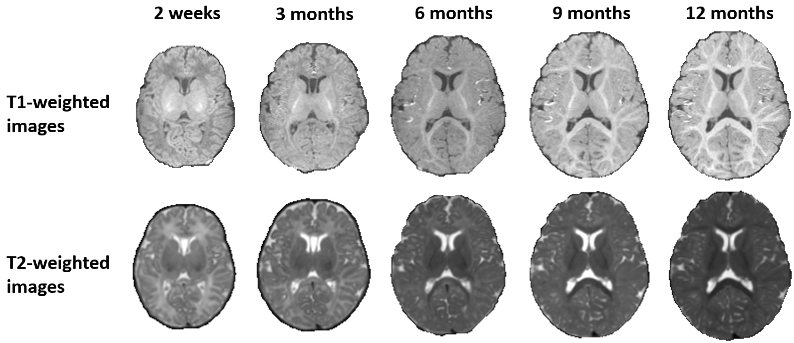
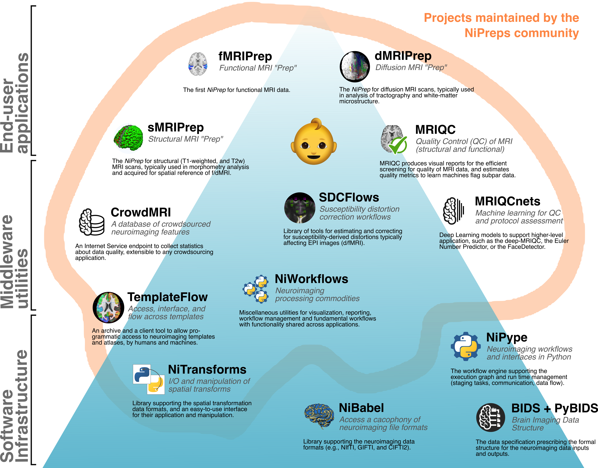
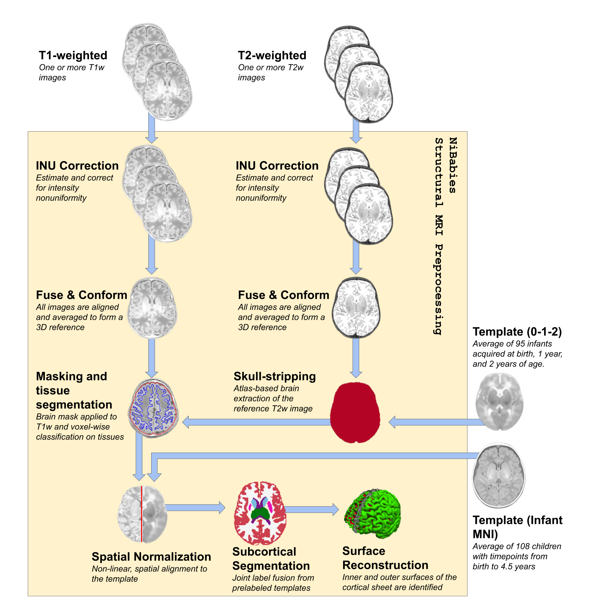
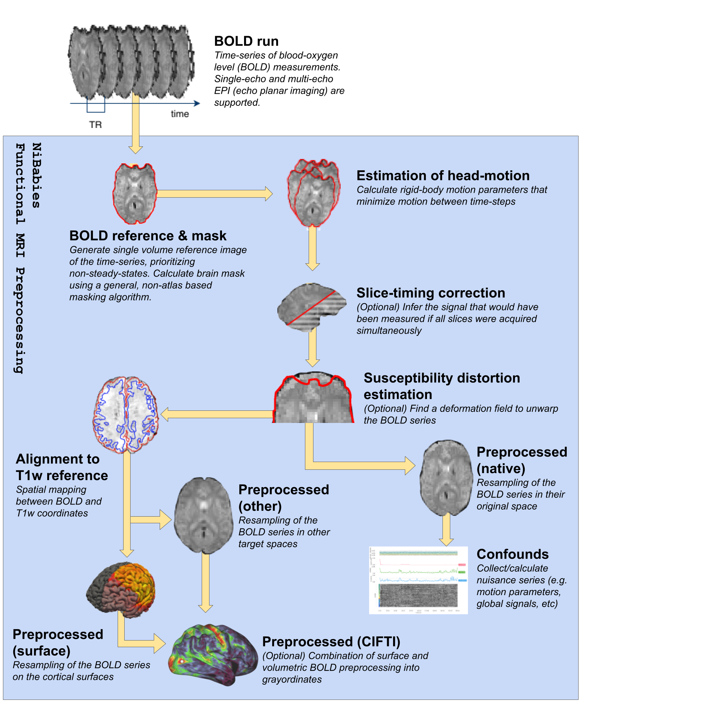
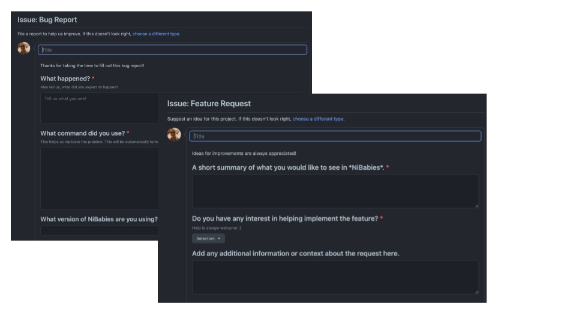

class: center middle

# NiBabies: A robust preprocessing workflow tailored for neonate & infant magnetic resonance imaging

### Mathias Goncalves
#### Center for Reproducible Neuroscience
#### Stanford University

###### Slides hosted at [https://mgxd.github.io/ismrm-nibabies](https://mgxd.github.io/ismrm-nibabies)

---
name: footer
layout: true

<div class="slide-slug">NiBabies - ISMRM-ESMRMB 2022 </div>

---

### *NiBabies* builds off the *fMRIPrep* success story
* Same philosophy: Easy-to-use, transparent, and robust.
* Impose minimal requirements
  * but will leverage add-ons if present (SDC, STC, etc)


???

fMRIPrep takes in a task-based or resting-state functional MRI dataset in BIDS-format and returns preprocessed data ready for analysis.

Some extras that it will leverage include: T2w, field maps and slice timing information

--

### *fMRIPrep* was created for fully-developed brains
* Relies on atlases generated by averaging 18-44y brains.
* Many default options are tweaked and tested for adult data.

???

Designed for general image processing, but tested mostly on adults.

--
* Neonate brain size and rapidly changing tissue contrasts present problems.


<div align="center">

</div>

???

Snapshot of brains across development.
Not only size, but notice the reduction in T1w contrast until after 6 months.

---

## NiPreps

<div align="center" style="margin-top: 1em">

</div>

???

Infrastructure - low-level interfaces (e.g., data access to images and spatial transforms) and utilities (see Figure 1).
Middleware: These utilities cover foundational processing methodologies and are generally reusable across end-user tools
End user: The user-facing applications held together by everything below them!

---

## The NiBabies Pipeline

<div style="float:left">
  
</div>
<div style="float:left">
  
</div>

--

* Explore a [sample report](sample-report/sub-01.html).

---

## Community engagement



--

```
pip install nibabies
pip install nibabies-wrapper
docker pull nipreps/nibabies:latest
```

---

class: center middle inverse

# Thank You

#### Questions?
#### Comments?
#### Suggestions?
##### [Contact us on GitHub](https://github.com/nipreps/nibabies/issues/new/choose)
